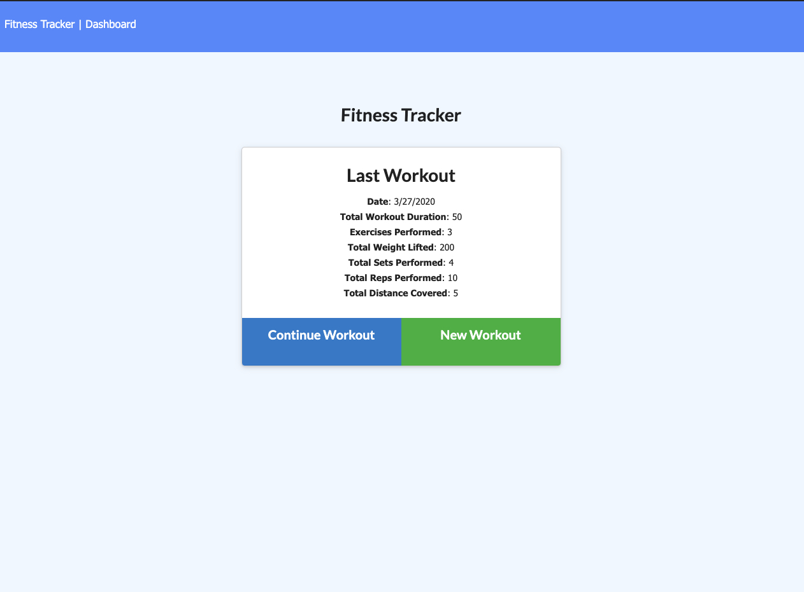
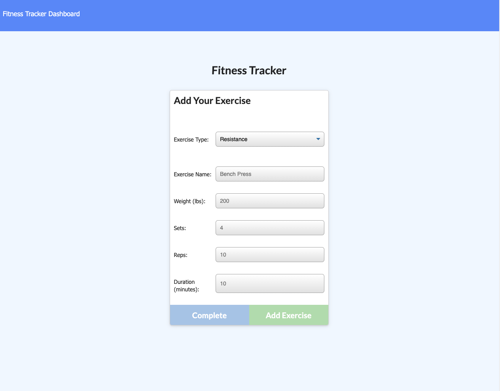
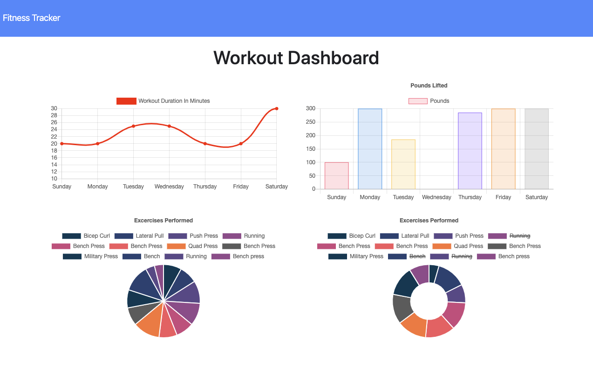

# Project #15: Workout Tracker

An application that allows it's users to track thier workouts throughout the week.

## Table of Contents

1. [About](#about)
2. [Getting Started](#getting-started)

## About

Workout Tracker is an application that enables users to view, create and track daily workouts. Along with being able to log multiple exercises in a workout on a given day. 

With the ability to track the name, type, weight, sets, reps, and duration of exercise. If the exercise is a cardio exercise, they are able to track by distance traveled.

## Images

Main Page

Form to create a Workout

Stats Page

## Getting Started on your own machine

Clone the application to your local machine:

``
git clone git@github.com:Braydon-Nelson/15-Workout-Tracker.git
``

Prepare the NPM Packages:

``
npm i
``

Seed your Database (MongoDB):

``
npm run seed
``

The application can be with the following command:

``
npm start
``

Start Tracking

## Built With
- [HTML](https://www.w3schools.com/html/)
- [CSS](https://www.w3schools.com/css/)
- [JavaScript](https://www.w3schools.com/javascript/)
- [Bootstrap](https://getbootstrap.com/)
- [Node](https://nodejs.org/)
- [Express - NPM](https://www.npmjs.com/package/express)
- [MongoDB](https://www.mongodb.com/)
- [Mongoose - NPM](https://www.npmjs.com/package/mongoose)
- [morgan - NPM](https://www.npmjs.com/package/morgan)

## Live Application

Link to live application - 
